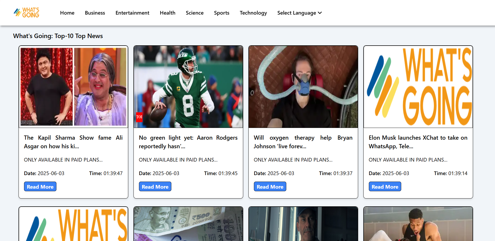

# 📰 What's Going?

**What's Going?** is a clean and minimal news web app that provides users with real-time, categorized news updates from various trusted sources. Built for speed and simplicity, it's your go-to app for staying informed across topics — all in one place.

🔗 **Live Demo**: [What's Going?](https://what-s-going-rljmngw0v-sachin-paithanes-projects.vercel.app/)

---

## ✨ Features

- 📰 Browse latest headlines across multiple categories
- ⚡ Fast and responsive user interface

---

## 🛠️ Tech Stack

[](https://reactjs.org/)  
[](https://tailwindcss.com/)  
[](https://newsdata.io/)

---

## 🧩 Skills Used

- API integration with Axios
- React functional components & hooks (`useState`, `useEffect`)
- Conditional rendering & filtering
- Tailwind CSS for styling

---

## 📸 Screenshot
### 📰 News Dashboard (PC View)


### 📰 News Dashboard (Mobile View)


---

## 🚀 Getting Started

To run this project locally:

```bash
git clone https://github.com/spaithane9172/whats-going.git
cd whats-going
npm install
npm start
